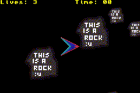
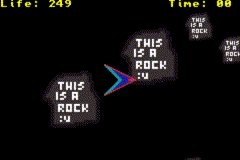

# Quantum-survival

## About

Quantum Survival is a very small and basic game submission I made for the GBA Jam 2021.
Download it [here](https://larkskwared.itch.io/quantum-sruvival)!
You will find two versions:

The original submission.
The final slightly improved version.

In this game, you are some kind of space ship or whatever that thing looks like.
You have to avoid being crashed by those giant meteors that jump through time and space.

## Gameplay



Original submission gameplay



Final version gameplay

Full gameplay video [here](https://youtu.be/DJDpwwcTC-M).
## How to play

Use the cross pad to move arroud the screen and press B to make a quantum jump.
Try to last 25 seconds to "win".

## How to build

1. Change the path to "tonc.h" in the "types.h".

```c
types.h

#include</path/to/tonc.h>
```

2. Change the path to "libtonc" in the make file.

```bash
LIBTONC	:= /path/to/libtonc
```

2. Open a terminal in the root folder of the project and build the project

```bash
$ make
```

## The little tools I made for faster development

Those are not something very special, but they can save you some time when working on something.
They execute terminal commands. That way, I didn't have to remember and type the whole thing when
converting files and running the game. You can compile them using any C compiler (like gcc).

## More info

This was the very first time I made something that runs on the GBA, that made it quite challenging for me.
It was also the very fist time I made a video game without using a game engine, that increased the challenge a lot.

This game was made for the Game Boy Advance.
Even though it works on emulators, it might not work properly or at all on a real GBA.

This project is licensed under the GNU GPLv3 license.
